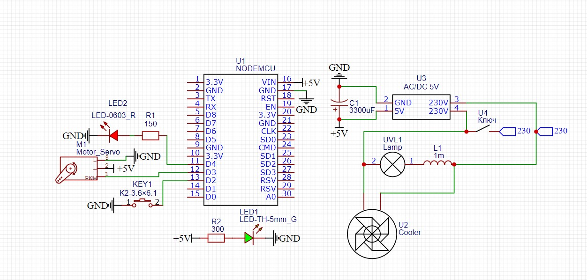
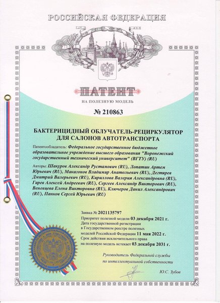

# Рециркулятор
Данный проект сделан для повышения безопасности, пользования общественным транспортом, в период covid-19.  
Схема устройства  
  
Патент  

## Цель
Оно должно работать
## Задачи
1. Сделать
## Приложение
### Принцип работы  
https://user-images.githubusercontent.com/45942307/190928318-8b8fa0ad-28ed-41b1-865c-0189dbc39036.mp4
https://user-images.githubusercontent.com/45942307/190928375-a0cac680-485a-4b2a-81c3-6b184b3e8d3f.mp4

